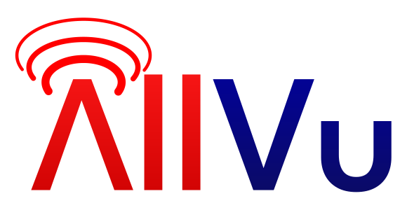

<h1 align="center"> Free and open source live video streaming solution</h1>

AllVu is a program written in Rust that enables easy and reliable live video streaming from a camera (or any other video input) to an RTMP server, similar to costly, paid solutions.

## Prerequisites
The only prerequisite to build and develop this program is ``cargo``

In order to run this program, you will need:
- Client machine with ``ffmpeg`` installed and a hardware encoder that supports VA-API
- **(Not required if running minimal client)** Server machine with ``ffmpeg`` installed
- RTMP server to send the video stream to

## Usage
<u>Note: There are no binary downloads for AllVu at the moment. In order to run it, you must build it from source.</u>

There are 2 different ways to use AllVu:
1. Minimal client
2. Client + Server (work in progress)
### Minimal client
The minimal client requires only a client machine to function, however it lacks features such as connection bonding and a sliding max bitrate. This can be useful if you're running on a stable enough connection where the max bitrate can stay static, or if you're using your own network bonding solution.

In order to configure the minimal client, create an ``allvu_client_minimal.toml`` file in the same directory as the executable, with the ``rtmp_server`` field defined. Afterwards, you may run the ``AllVu_ClientMinimal`` executable.

### Client + server
This method is currently work in progress.

## Building from source
To build AllVu, run ``cargo build`` inside of the main directory.

Afterwards, there will be 3 executables inside of the ``target`` directory: **AllVu_Server**, **AllVu_Client** and **AllVu_ClientMinimal**